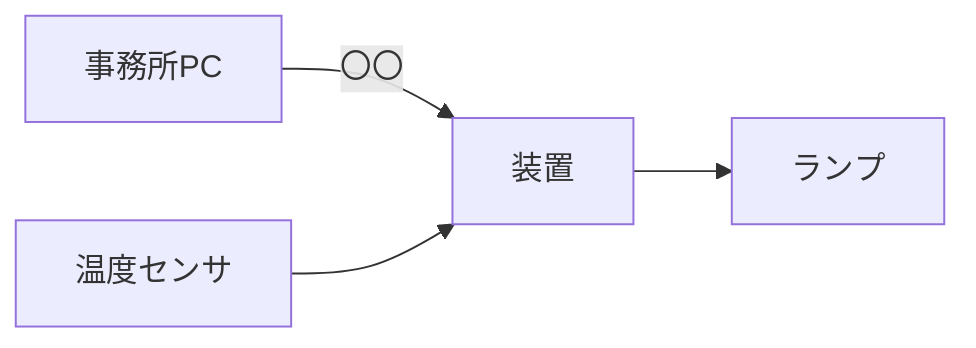

# 要件定義書（システム名）

| 項目 | 内容 |
|---|---|
| 版 | 0.1 |
| 作成日 | YYYY-MM-DD |
| 作成者 | |
| 顧客 | みどり農園 佐藤様 |
| 状態 | 草案 / 顧客確認中 / 合意済み |

## 1. 目的と背景
なぜこのシステムを作るのか。顧客の業務で何が困っていて、導入後に何が変わるのかを、顧客の言葉に近い形で書く。数字（損失額、頻度）があれば入れる。

## 2. スコープ
### 2.1 対象
このシステムが担うこと。
### 2.2 対象外
担わないこと。顧客が口にした要望のうち、今回やらないと合意したものはここに書く（理由も）。
### 2.3 前提と制約
設置環境、既存設備、予算、納期、法規、顧客側の作業分担。

## 3. 利用者と利用環境
| 利用者 | 役割 | 操作するもの | 技術的な知識 |
|---|---|---|---|
| | | | |

設置場所の環境（温度範囲、湿度、粉塵、電源、通信経路とその距離）。

## 4. システムの全体像
外部から見た入出力を1枚の図にする（Mermaid）。機器の中身はまだ書かない。

## 5. 機能要件
1行1要件。ID は変えない。「〜できること」の形で、確認方法が想像できる粒度で書く。

| ID | 要件 | 優先度 | 根拠（依頼メモ / 議事録の箇所） |
|---|---|---|---|
| REQ-F-001 | | 必須 / 重要 / 任意 | |

## 6. 非機能要件
数値で書く。数値にできないものは「どう確認するか」を書く。

| ID | 分類 | 要件 | 確認方法 |
|---|---|---|---|
| REQ-N-001 | | | |

分類の例（1分類に複数の要件があってよい）。性能（応答時間、測定間隔）、可用性（停電、復帰）、保守性（設定変更、部品交換）、環境（温度、防水、電源）、安全（誤動作時に何が起きるか）。

## 7. 外部インターフェース
接続する相手ごとに、物理（コネクタ、ケーブル、距離）と論理（プロトコル、設定値）を書く。詳細なコマンド仕様は基本設計に送るが、「文字ベースのコマンドで対話する」といった方式はここで決める。

## 8. 用語
顧客の言葉と技術用語の対応。「ランプ」「おかしい」「すぐに」など、要件で使った言葉の定義。

| 用語 | 定義 |
|---|---|
| | |

## 9. 未決事項
決められなかったこと、顧客に確認待ちのこと、決めたが自信がないこと。担当と期限を付ける。

| # | 内容 | 担当 | 期限 |
|---|---|---|---|
| | | | |

## 10. 変更履歴
| 版 | 日付 | 内容 |
|---|---|---|
| 0.1 | | 初版 |
