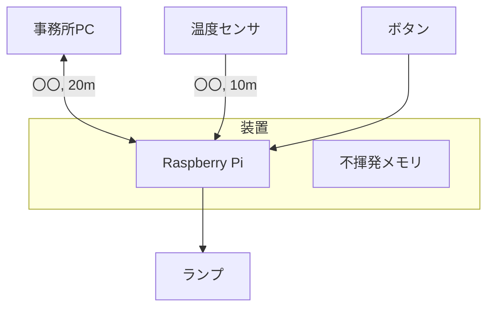
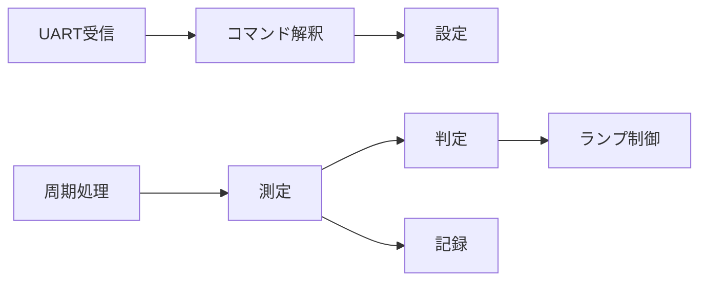
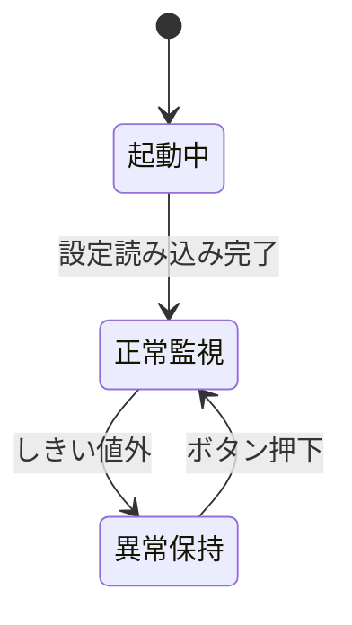

# 基本設計書（システム名）

| 項目 | 内容 |
|---|---|
| 版 | 0.1 |
| 作成日 | YYYY-MM-DD |
| 作成者 | |
| 対応する要件定義書 | 要件定義書 版 x.x |

## 1. 設計方針
要件のうち、設計を決める上で効いた条件を3〜5行で書く。「停電復帰後に設定を保持する必要があるため不揮発メモリを持つ」のように、要件 ID を引く。

## 2. システム構成
### 2.1 ハードウェア構成
装置の中身と外部機器を1枚の図にする。ケーブルの種類と距離を書く。

### 2.2 部品一覧
| 部品 | 型番または種別 | 選定理由（要件 ID） | 概算 |
|---|---|---|---|
| | | | |

### 2.3 ソフトウェア構成
処理の塊（モジュール）と、その間のデータの流れ。ex04 のコマンド振り分けをどこに置くかが見えるように。

## 3. 機能一覧
要件 ID と、それを実現するモジュールの対応。1要件が複数モジュールにまたがってよい。

| 要件 ID | 機能名 | 実現するモジュール | 備考 |
|---|---|---|---|
| REQ-F-001 | | | |

## 4. 外部インターフェース仕様
### 4.1 PC との通信
物理層（ケーブル、コネクタ、信号レベル）、伝送設定（速度、データ長、パリティ、ストップビット）、行の終端。

### 4.2 コマンド仕様
`ex04_cmd_table` の `cmd_dispatch` で振り分けられる形式にする。制約は `src/cmd.h` のとおり、1行1コマンド、空白1文字区切り、先頭がコマンド名（大文字小文字を区別）、コマンド名を含めて8トークンまで、応答は1コマンドにつき1バッファ。記録の一覧のように応答が長くなるコマンドは、複数回に分けて取り出す方法をここで決める。

| コマンド | 引数 | 応答（正常） | 応答（異常） | 対応する要件 ID |
|---|---|---|---|---|
| | | | | |

エラー応答の形式（`ERR <理由>` など）を1つに決める。

### 4.3 センサ
種別、接続方式、距離に対する対策、読み取り間隔、故障の検出方法。

### 4.4 ランプとボタン
色と意味の対応表。ボタンの長押し・二度押しをどう扱うか。

## 5. 状態遷移
装置全体の状態（起動中、正常監視、異常検出、異常保持、停電復帰など）と遷移の条件。

状態ごとにランプがどう光るかを表にする。

## 6. データ設計
### 6.1 設定値
| 項目 | 型 | 範囲 | 初期値 | 保存先 | 対応する要件 ID |
|---|---|---|---|---|---|
| | | | | | |

### 6.2 記録
1件の内容、間隔、保持件数、満杯時の扱い、保存先。固定長の領域を古いものから上書きするリングバッファが使えないか検討する（`phase3_cpp/ex01_ring_buffer` をやっていれば、その構造）。

## 7. 異常処理
| 異常 | 検出方法 | 装置の振る舞い | 利用者への見せ方 | 対応する要件 ID |
|---|---|---|---|---|
| センサ無応答 | | | | |
| 不正なコマンド | | | | |
| 停電からの復帰 | | | | |

## 8. 非機能要件の実現方針
要件定義書の 6章の各 ID について、どの設計でそれを満たすかを1行ずつ。

| 要件 ID | 実現方法 | 確認方法 |
|---|---|---|
| REQ-N-001 | | |

## 9. 未決事項
| # | 内容 | 担当 | 期限 |
|---|---|---|---|
| | | | |

## 10. 変更履歴
| 版 | 日付 | 内容 |
|---|---|---|
| 0.1 | | 初版 |
